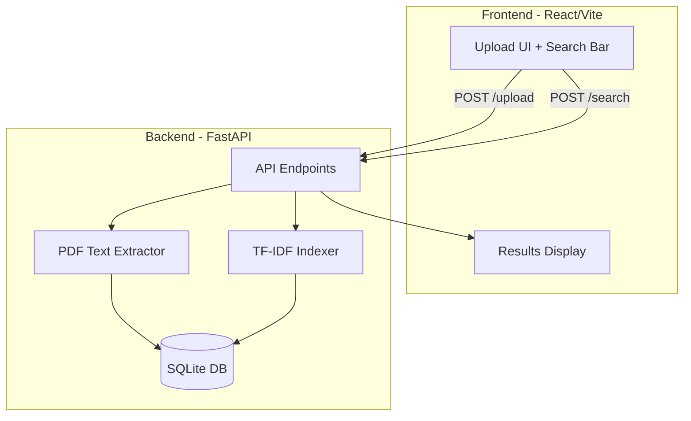

# PDF Search Web Application

## Architecture Overview



## Project Structure

```
pdf_search_app_p1/
├── backend/
│   ├── app/
│   │   ├── __init__.py
│   │   ├── main.py           # FastAPI app entry point
│   │   ├── database.py       # SQLite setup + models
│   │   ├── pdf_extractor.py  # PDF text extraction (PyMuPDF)
│   │   ├── search_engine.py  # TF-IDF + cosine similarity
│   │   └── schemas.py        # Pydantic models
│   ├── tests/
│   │   ├── __init__.py
│   │   └── test_api.py       # Pytest tests
│   ├── requirements.txt
│   └── README.md
├── frontend/
│   ├── src/
│   │   ├── App.tsx           # Main component
│   │   ├── components/
│   │   │   ├── FileUpload.tsx
│   │   │   ├── SearchBar.tsx
│   │   │   └── SearchResults.tsx
│   │   ├── api.ts            # API client
│   │   └── types.ts          # TypeScript types
│   ├── package.json
│   └── vite.config.ts
└── README.md                  # Root instructions
```

## Backend Implementation

### 1. Dependencies (`backend/requirements.txt`)

- `fastapi` - Web framework
- `uvicorn` - ASGI server
- `python-multipart` - File uploads
- `pymupdf` (fitz) - PDF text extraction
- `scikit-learn` - TF-IDF vectorizer + cosine similarity
- `pytest` + `httpx` - Testing

### 2. Database Schema (`backend/app/database.py`)

SQLite table `pdfs`:

- `id` (TEXT, PRIMARY KEY) - UUID
- `filename` (TEXT)
- `text_content` (TEXT)
- `upload_time` (TIMESTAMP)
- `file_size` (INTEGER)

### 3. API Endpoints (`backend/app/main.py`)

| Endpoint | Method | Description |

|----------|--------|-------------|

| `/upload` | POST | Accept multipart files, extract text, store in DB, return pdf_ids |

| `/search` | POST | Accept query, run TF-IDF search, return ranked results |

| `/pdf/{pdf_id}` | GET | Return PDF metadata |

### 4. PDF Extraction (`backend/app/pdf_extractor.py`)

- Use PyMuPDF (fitz) to extract text from each page
- Handle errors: corrupted PDFs, empty content, size limits (10MB max)

### 5. Search Engine (`backend/app/search_engine.py`)

- Load all document texts from DB
- Build TF-IDF matrix using `TfidfVectorizer`
- Compute cosine similarity between query and all documents
- Extract snippet around best matching terms (50 chars context)
- Return results sorted by confidence score (0-1)

## Frontend Implementation

### 1. Dependencies (`frontend/package.json`)

- React 18 + TypeScript
- Vite build tool
- `axios` for API calls
- Basic CSS (no external UI library needed)

### 2. Components

**FileUpload.tsx**

- Drag-and-drop zone + file picker button
- Accept only `.pdf` files
- Show upload progress/status
- Display list of uploaded files

**SearchBar.tsx**

- Text input with search button
- Trigger search on Enter key

**SearchResults.tsx**

- Display ranked results as cards
- Show: filename, confidence score (%), highlighted snippet
- Sort by confidence descending

### 3. API Client (`frontend/src/api.ts`)

- `uploadPDFs(files: File[])` - POST to /upload
- `searchPDFs(query: string)` - POST to /search

## Error Handling

- **Bad PDFs**: Return 400 with message "Could not extract text from PDF"
- **Empty text**: Return 400 with message "PDF contains no extractable text"
- **Large files**: Return 413 if file > 10MB
- **No results**: Return empty array with 200

## Testing (`backend/tests/test_api.py`)

- Test upload endpoint with valid PDF
- Test upload with invalid file type
- Test search with results
- Test search with no results
- Test get PDF metadata

## Commands to Run Locally

**Terminal 1 - Backend:**

```bash
cd backend
python -m venv venv
source venv/bin/activate  # On Windows: venv\Scripts\activate
pip install -r requirements.txt
uvicorn app.main:app --reload --port 8000
```

**Terminal 2 - Frontend:**

```bash
cd frontend
npm install
npm run dev
```

**Push to GitHub:**

```bash
git init
git add .
git commit -m "Initial commit: PDF Search app with React frontend and FastAPI backend"
git remote add origin <your-github-repo-url>
git push -u origin main
```